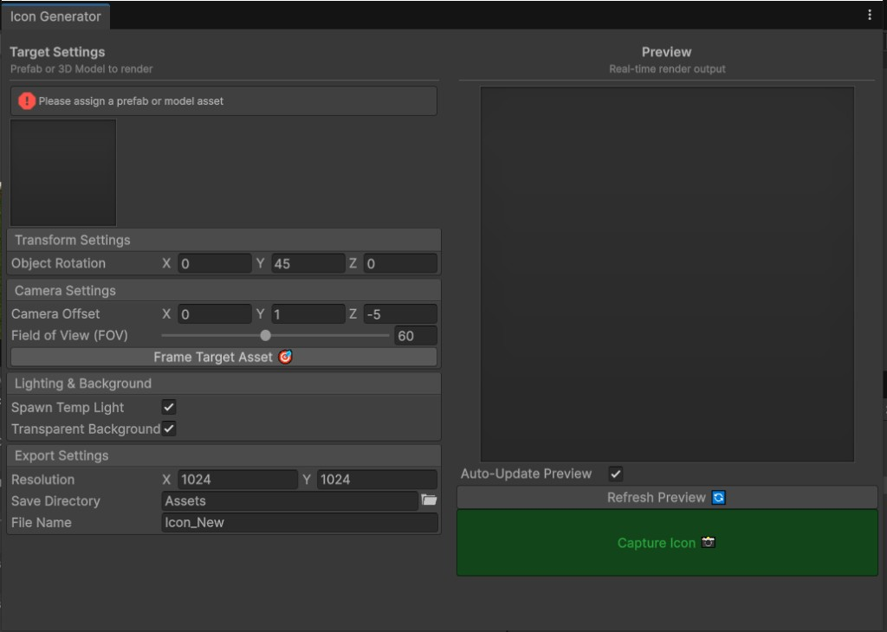

# Asset Icon Generator

[](https://unity.com/)
[](LICENSE)

Unity Editor tool for generating **high-quality PNG icons and thumbnails** from prefabs and 3D models using **real-time rendering** — no scene setup required.



---

## Features

- **Real-time preview** — live render output with optional auto-refresh as you tweak settings
- **Auto-framing** — one-click **Frame Target Asset** camera positioning from mesh bounds
- **Custom background** — transparent PNG or solid color; optional temporary directional light
- **Resolution settings** — export at any size (default 1024×1024); preview scales down for performance
- **Odin-powered UI** — clean two-column layout built with **Odin Inspector**

---

## Requirements

| Requirement | Notes |
|-------------|-------|
| Unity | **2021.3** or newer |
| **Odin Inspector (Sirenix)** | **Required** — this package uses `OdinEditorWindow` and Odin attributes |

> Odin Inspector is **not** bundled. Install it from the [Asset Store](https://assetstore.unity.com/packages/tools/utilities/odin-inspector-and-serializer-89041) or your existing Sirenix license before adding this package.

---

## Installation

1. Install **Odin Inspector** in your project.
2. Open **Window → Package Manager**.
3. Click **+ → Add package from git URL...**
4. Paste:

```
https://github.com/makarGames/Unity-Asset-Icon-Generator.git
```

Git URL: [https://github.com/makarGames/Unity-Asset-Icon-Generator.git](https://github.com/makarGames/Unity-Asset-Icon-Generator.git)

---

## Usage

1. Open **Tools → Asset Icon Generator 📸**
2. Assign a **prefab** or **3D model** to **Target Asset**
3. Adjust rotation, camera, FOV, lighting, and background
4. Use **Frame Target Asset** to auto-fit the camera
5. Click **Capture Icon** to save a PNG under your chosen folder

Default save path: `Assets/` with filename from the target asset name.

---

## Package layout

```
com.makargames.asset-icon-generator/
├── package.json
├── README.md
├── CHANGELOG.md
├── LICENSE
└── Editor/
    ├── Makargames.AssetIconGenerator.Editor.asmdef
    └── AssetIconGeneratorWindow.cs
```

---

## License

[MIT License](LICENSE)
